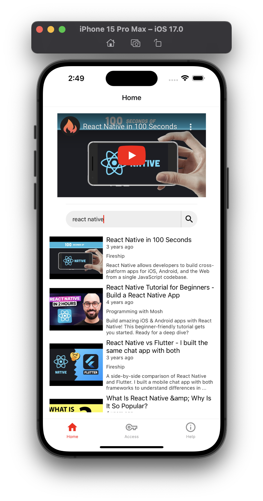
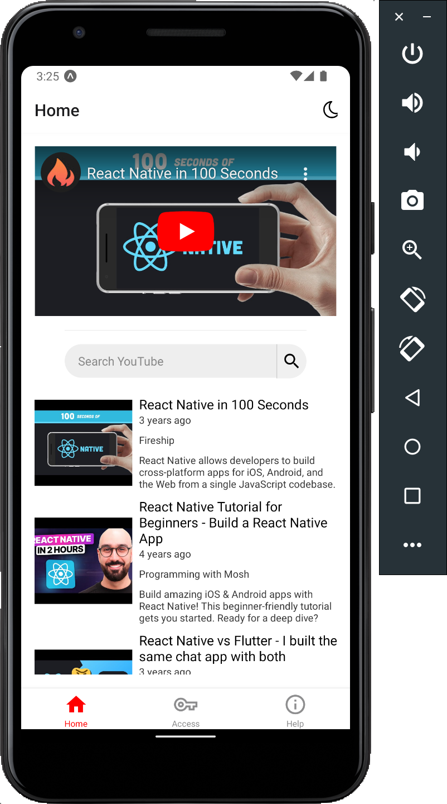
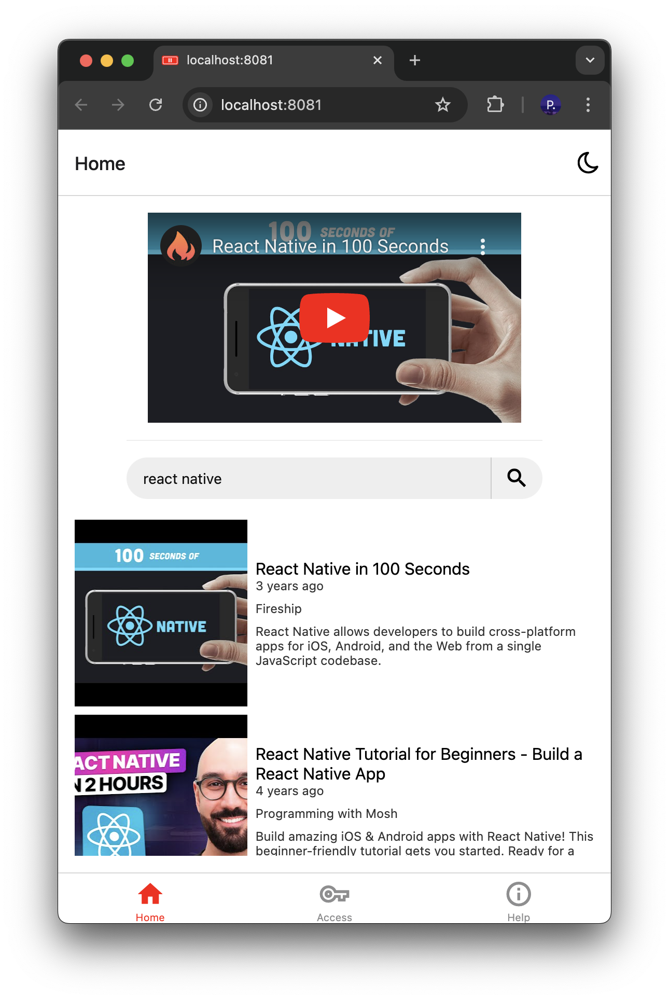
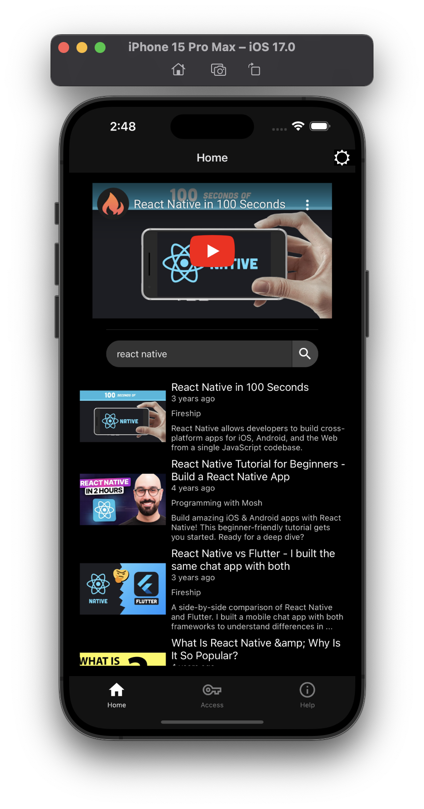
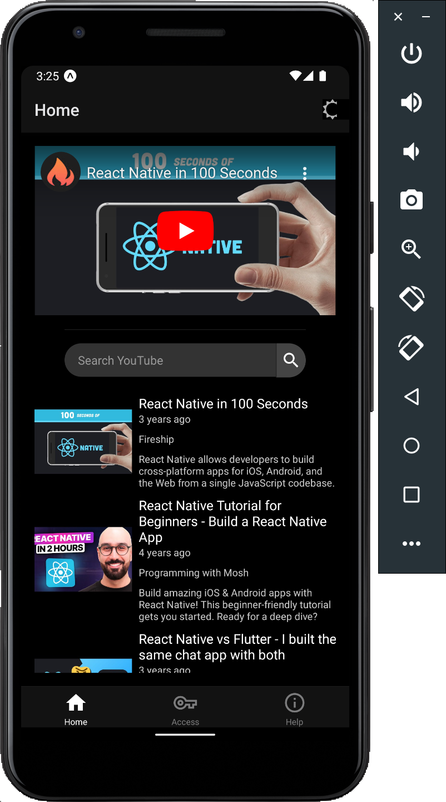
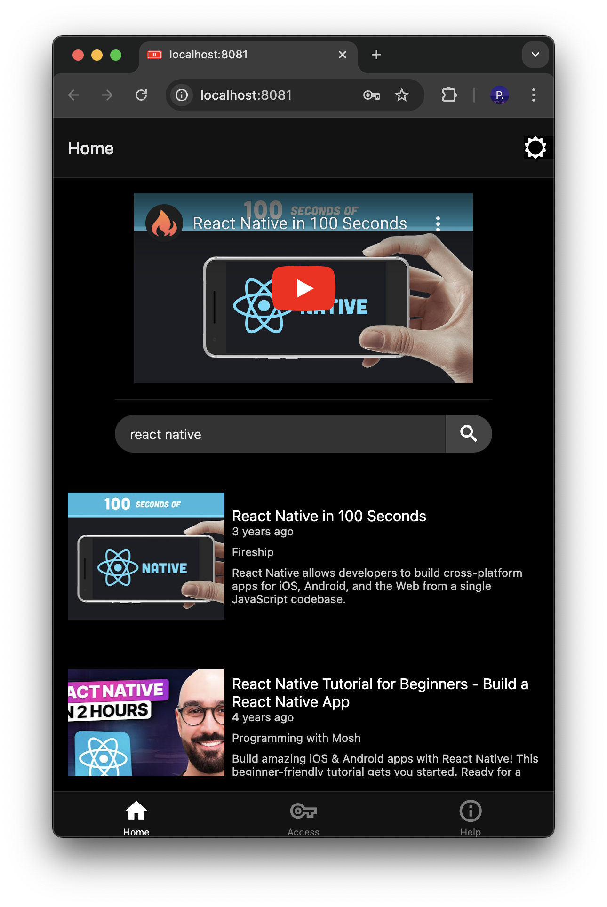

<div align="center">
  
</div>

<h1 align="center"> 
  AI-less YouTube
</h1>

<h3 align="center">
  🤖🚫📺 a YouTube video search app with no AI for iOS, Android, and the Web
</h3>

<br/>

<div align="center">
  
  
  
</div>

This app is also available in dark mode:

<div align="center">
  
  
  
</div>

## System Prerequisites

Ensure you have the latest LTS (long-term support) version of [Node.js](https://nodejs.org/) installed on your system.

Recommended installation instructions are available [here](https://nodejs.org/en/download/package-manager).

## Local Project Setup

Somewhere in your file system, run either

```bash
git clone https://github.com/pjnalls/ai-less-youtube.git
```

if you aren't connect to GitHub with any SSH keys, **_or_**

```bash
git clone git@github.com:pjnalls/ai-less-youtube.git
```

if you are.

Next, navigate to the root of the newly cloned project by running the following:

```bash
cd ai-less-youtube/
```

Then, install a `node_modules` folder for all the project's dependencies:

```bash
npm i
```

## [EAS](https://docs.expo.dev/build/introduction/) Project Builds

Ensure the `eas-cli` is installed globally on your machine:

```bash
npm i -g eas-cli
```

Run the following command and follow the instructions in the CLI to create EAS builds for iOS (Apple Developer account needed) and Android:

```bash
eas build --profile development --platform all
```

Alternatively, you can build for a single platform at a time as builds may take some time to complete:

Run

```bash
eas build --profile development --platform ios
```

to create EAS builds for iOS only, and run

```bash
eas build --profile development --platform android
```

to create EAS builds for iOS only.

## Run iOS, Android, and/or Web Apps

Run the following to run the Expo app:

```bash
npm start
```

Then, scan the barcode that appears and run the React Native app from an iOS or and Android device.

Press `w` to open the web version of the React Native app in the browser.

**NOTE**: It's possible to run an iPhone, Android phone, and the browser on the same React Native app instance for cross-platform development. Also, simultaneous, universal Fast Refresh has been enabled for this app.
